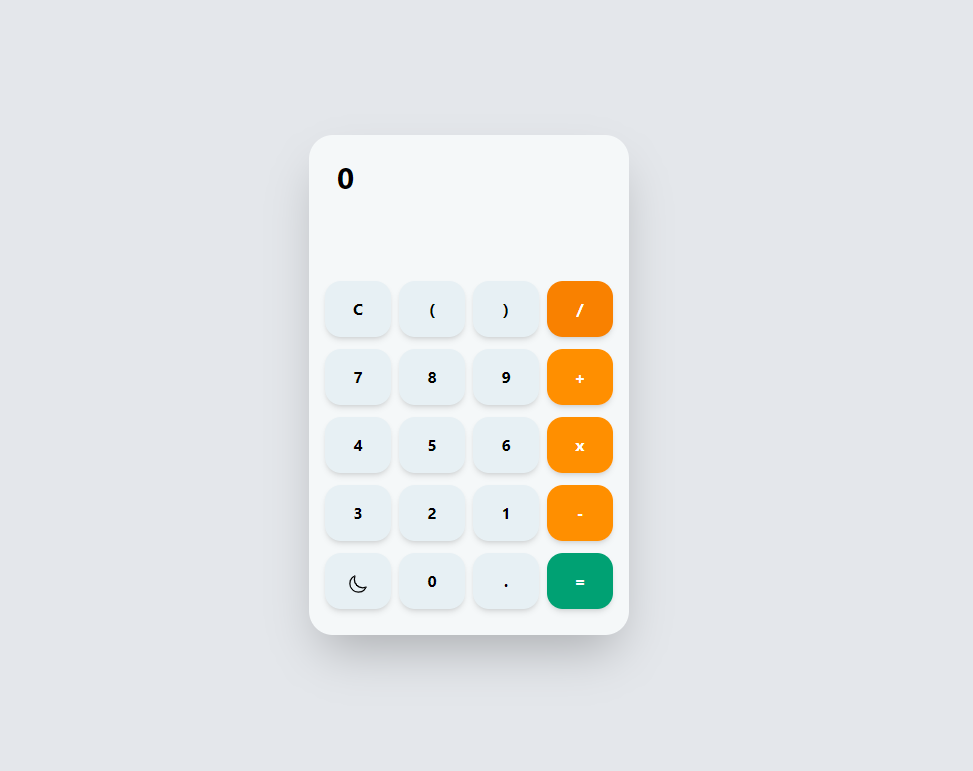
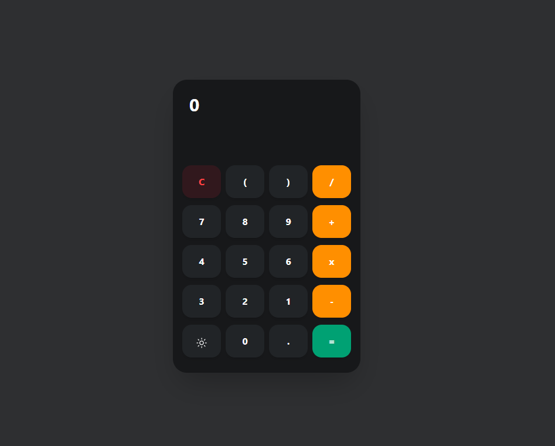

## JavaScript Eval() Method Calculator with tailwindCSS
A functional calculator built with TailwindCSS/Flowbite and JavaScript eval() method.

Test it here : https://calculator-tailwindcss.netlify.app/

